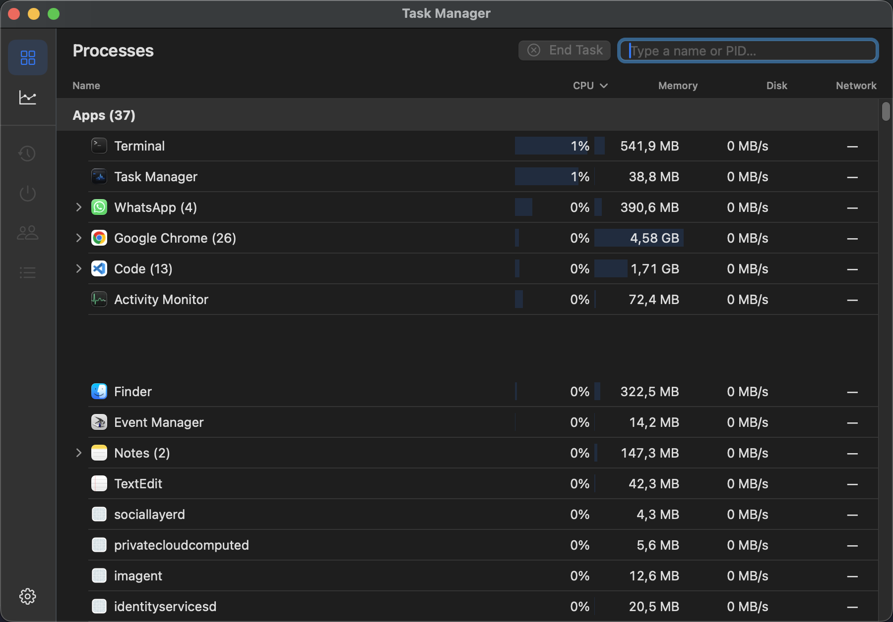
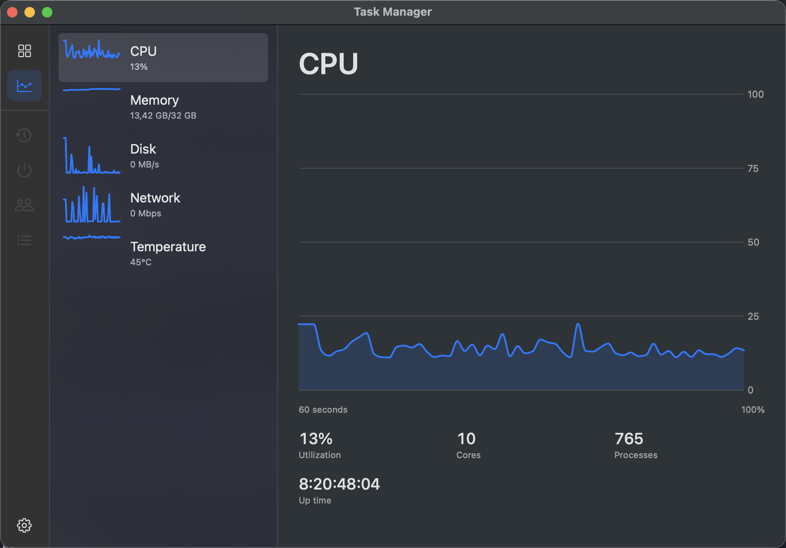

# Task Manager

A Windows 11 Task Manager–style Processes/Performance view for macOS, built
because Activity Monitor's CPU% is genuinely confusing: it sums usage
per-core, so an 8-core Mac can show 400%+ for a single busy app. This
normalizes CPU% to the whole system's capacity instead — a process pegging
one core on an 8-core Mac reads ~12%, not ~100%, matching what Windows shows.

<p align="center">
  
  
</p>

## What it does

- **Processes** — grouped into Apps / Background processes, sortable columns
  (Name, CPU, Memory, Disk), expandable groups (see every helper process
  inside "Google Chrome (24)"), End Task with a force-quit fallback,
  right-click for Restart / Efficiency Mode / Open File Location / Search
  Online / exact resource values.
- **Performance** — live 60-second graphs for CPU, Memory, Disk, Network, and
  CPU/GPU Temperature, with the same per-metric detail panel Windows shows.
- **Menu bar** — CPU / Memory / Disk / Network / Temperature at a glance,
  configurable in Settings (⌘,) — pick which ones actually show.

All of it reads real data through public and long-established (if
undocumented) macOS APIs — `libproc`, Mach host statistics, IOKit, and a
direct SMC connection for temperature. No sandboxing, no App Store
distribution (a sandboxed app can't see the system process list at all —
neither can Activity Monitor if you sandbox it), no root, no privileged
helper.

## What it deliberately doesn't do (yet)

Some of Windows Task Manager's features don't have a macOS equivalent, or
need a privileged helper this project doesn't ship yet:

- **Per-process network usage** — macOS doesn't expose this without a
  privileged helper (SMJobBless + `powermetrics`/packet inspection). Shown
  as `—` for now.
- **Services / Startup Apps / App History / Users / Details tabs** — visible
  but disabled in the sidebar. `launchd` and Login Items are a different
  enough model from Windows Services that they need their own design, not a
  reskin.
- **CPU affinity / process priority classes** — macOS doesn't expose
  per-core affinity to user processes at all (Apple Silicon's scheduler
  doesn't take suggestions). Efficiency Mode is real (it sets the process's
  nice value), just not the same mechanism as Windows' Job Objects.

## Installing

Download the latest `.zip` from [Releases](../../releases), unzip, and drag
`TaskManager.app` to `/Applications`.

The app is **not notarized** (that requires a paid Apple Developer
account). macOS will refuse to open it the first time — right-click the app
and choose **Open**, then confirm. You only need to do this once.

## Building from source

```sh
git clone https://github.com/tranteagratian/task-manager.git
cd task-manager
swift build
./Scripts/make-app.sh          # debug build -> build/TaskManager.app
./Scripts/make-app.sh release  # release build
```

Requires Swift 6.1+ (Xcode 16.3+ or the matching Command Line Tools) and
macOS 14+. There's no Xcode project — it's a plain SwiftPM package;
`Scripts/make-app.sh` does the small amount of `.app` bundling Xcode would
otherwise do invisibly.

Two debug flags help when something looks wrong without needing to attach a
debugger or screenshot the running app:

```sh
.build/debug/TaskManager --dump-groups   # prints the current Processes grouping to stdout
.build/debug/TaskManager --dump-temps    # prints raw CPU/GPU temperature readings
```

## Architecture

- `TaskManagerCore` — the data layer. No SwiftUI, no AppKit dependency
  beyond `NSWorkspace`/`NSRunningApplication` for app grouping and icons.
  Everything here is testable in isolation: process sampling (`libproc`),
  system-wide stats (Mach host APIs, IOKit block-storage statistics,
  interface byte counters), SMC temperature reads, process grouping,
  termination, and priority.
- `TaskManager` — the SwiftUI app: the windowed UI, the menu bar (a
  hand-managed `NSStatusItem`, not SwiftUI's `MenuBarExtra` — see the doc
  comment on `StatusBarController` for why), and Settings.

## Credits

The SMC temperature-reading technique (an IOKit user-client connection to
the `AppleSMC` service, reading fixed-point sensor values by undocumented
per-generation key) is the same one [iStat Menus](https://bjango.com/mac/istatmenus/),
TG Pro, and the open-source [Stats](https://github.com/exelban/stats) app
use. This project's implementation was written by reading and adapting
Stats' MIT-licensed `SMC/smc.swift` and `Modules/Sensors/values.swift`.

## License

MIT — see [LICENSE](LICENSE).
